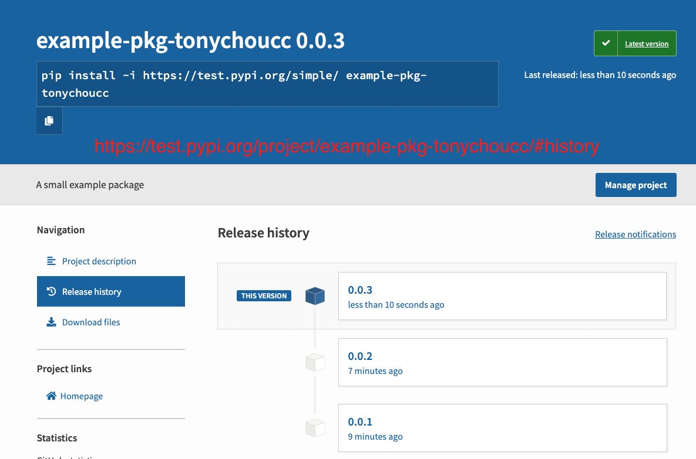

# Test PyPI

- https://packaging.python.org/tutorials/packaging-projects/#setup-py
- 2019/12/23

```bash
### 打包工具
$# pip install --upgrade setuptools wheel twine
# 將來這些打包起來的 package 經上傳到 repo 後, 可用 pip install 下載安裝
# setuptools : 用來封裝 python proj 和擴充功能, 以進行發布 (這個不是標準函式庫的東西, 但比標準函式庫的 distutils 好多了!)
# wheel : (打包必備)
# twine : 可以用來上傳 distribution packages 到遠端 repo

### 產生 發布版本的套件(distirbution packages) - 會把東西丟到 dist/
$# python setup.py sdist bdist_wheel
# *.whl : 使用 bdist_wheel 打包出來的 (built distribution). 建立一個可被跨平台安裝的 wheel
# *.tar.gz : 使用 sdist 打包出來的 (source distribution)

### 上傳 distribution 最新版本
$# twine upload --repository-url https://test.pypi.org/legacy/ dist/*
#                                ^^^^^^^^^^^^^^^^^^^^^^^^^^^^^
# 也可使用自己的倉庫, ex: http://192.168.0.105:8080  (不知為啥的, 上傳超久)
# 當然... 裡頭的服務要打開
Uploading distributions to https://test.pypi.org/legacy/
Enter your username: tonychoucc
Enter your password:
Uploading example_pkg_tonychoucc-0.0.1-py3-none-any.whl
100%|██████████████████████████| 7.45k/7.45k [00:02<00:00, 3.23kB/s]
Uploading example-pkg-tonychoucc-0.0.1.tar.gz
100%|██████████████████████████| 6.27k/6.27k [00:01<00:00, 4.50kB/s]

View at:
https://test.pypi.org/project/example-pkg-tonychoucc/0.0.1/
# 以上的指令, 「--repository-url XXX」, 可定義在 ~/.pypirc, 將來使用 「-r XX」 來使用


# 把東西打包到 testpypi
```




# Usage

```ini
### ~/.pypirc ( chmod 0600 ~/.pypirc )
# twine 所需
# 密碼以明文列出, 也可不輸入在此, 將來使用時逐次輸入
[distutils]
index-servers=
  pypi
  privatepypi

[pypi]
repository=https://pypi.python.org/pypi
username=cool21540125
password=

[privatepypi]
repository=http://192.168.2.100:23380
username=python
password=
```

```bash
### 安裝剛剛包上去的鳥東西
(venv)$ pip install -i https://test.pypi.org/simple/ example-pkg-tonychoucc
# -i, --index-url REPO: 從 REPO 下載

# 或者, 原始碼下載下來後
(venv)$ python setup.py install
```


# wheels

```bash
pip install wheel
```

- wheel 用來發布 python 模組 && 套件, 前身為 `eggs` 封裝形式. 相較之下, `wheels` 被視為 `建置好(built)的 distributions`. 所以使用上, 不需要再 build 了
- 受到 PyPI 支援, pip 較偏好此項 (相較於 標準函式庫 的 distutils)


# CICD


```sh
# Test PyPI
# GitHub Actions CI/CD — project-org/project-repo
# https://test.pypi.org/manage/account/token/
pypi-AgENdGVzdC5weXBpLm9yZwIkNGY3OWE4YTUtNDhjMS00YzQ3LWEwNWUtNDRmODNhZjJkZGI1AAJHeyJwZXJtaXNzaW9ucyI6IHsicHJvamVjdHMiOiBbImV4YW1wbGUtcGtnLXRvbnljaG91Y2MiXX0sICJ2ZXJzaW9uIjogMX0AAAYg05LEBk5lQO3jEiLLtrLgN10d8bLt-dAZc-mtPf8o6vY
```


# 搭建 PyPI Server

- http://cloga.info/python/2019/07/07/build_your_private_pip_source

搭建方式有很多種, 在此使用最簡單的方式 `pypiserver`

```bash
### 使用虛擬環境底下的 python3
cd ~
mkdir privatepypi
cd privatepypi
mkdir packages
python3 -m venv venv
source venv/bin/activate

### 安裝 pypi server
pip install pypiserver

### 可用來把要提供來讓人家安裝的套件, 把它放置到 pypiserver 的倉庫
pip install pip2pi

### 這裡頭記載, pypi server 要提供給人家安裝的東西們
touch requirements.txt

### 把要提供的套件們, 透過 pip2pi 安裝並放置到 ~/privatepypi/packages
pip2pi ~/privatepypi/packages -r requirements.txt

### 啟動 server (記得開 firewalld)
pypi-server -p 8888 ~/privatepypi/packages
# 預設會以 ~/packages 當作 PyPI 的倉庫
```

```bash
### 用戶端
pip install --extra-index-url http://tonyos7vm:8888 beautifulsoup4
```


# 加密保護

```bash
$# yum install -y httpd

$# htpasswd -sc .htpasswd tony
# 輸入密碼

$# pypi-server -p 8080 -P .htpasswd ./packages/
# 啟用認證方式, 才可接受上傳下載
```


# pypi-client

```bash
### Upload
$# twine upload -r http://192.168.0.105:8080 dist/*

### auth
$# python setup.py register -r privatepypi
```